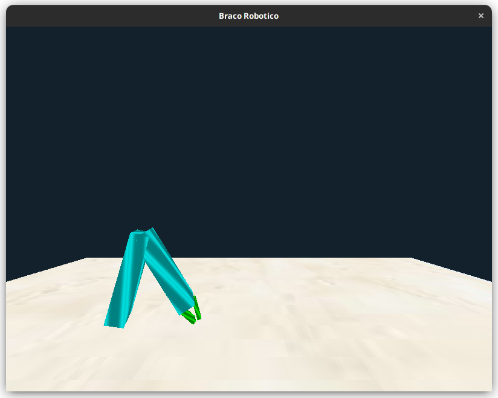

# Projeto Final

pinball (kindof)


## Execute os testes !!

```shell
python -m unittest discover  -v 
```

## Instale as dependências 
```shell
pip install -r requirements.txt
```

## Observações
Foi utilizado a versão __3.10__ do python 

## execução da aplicação:
```shell
python  src/main.py    
```

### Controle do braço

- q aciona flipper esquerdo
- p acdiona flipper direito
- space lança a bola 


Setinhas, esquerda, direita, frente e trás controla a visão da camera.


<!--  -->